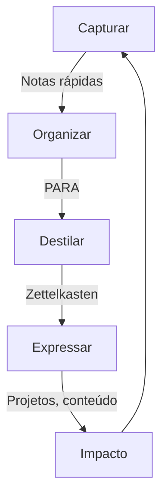

# Método CODE - Fluxo de Gestão do Conhecimento

O método CODE (Capture, Organize, Distill, Express) do Tiago Forte estabelece um fluxo de trabalho para transformar informações brutas em conhecimento acionável.

## As Quatro Etapas do CODE

### [[pkm.code.capture]] - Capturar

O processo de coletar informações valiosas no formato mais bruto.

**Princípios:**
- Capturar apenas o que ressoa
- Manter o processo leve e simples
- Usar diferentes entradas (texto, áudio, imagem)
- Não se preocupar com organização neste estágio

**No Dendron:**
- Usar `pkm.code.capture.[tópico]` para notas rápidas
- Usar dispositivos móveis para capturar em movimento
- Configurar integrações para importar de outras fontes

### [[pkm.code.organize]] - Organizar

Processar e arquivar informações usando o sistema PARA.

**Princípios:**
- Organizar por acionabilidade/relevância atual
- Usar a estrutura PARA para determinar a localização
- Adicionar metadados e tags para facilitar recuperação
- Manter o processo simples e sustentável

**No Dendron:**
- Refatorar notas de `code.capture` para `para.[categoria]`
- Adicionar tags e links para outras notas
- Criar hierarquias usando a nomenclatura com pontos

### [[pkm.code.distill]] - Destilar

Transformar notas em ideias concisas e úteis.

**Princípios:**
- Destacar e resumir pontos principais
- Reescrever em suas próprias palavras
- Conectar com conhecimento existente
- Identificar padrões e princípios fundamentais

**No Dendron:**
- Criar notas atomizadas no estilo Zettelkasten (`zettel.permanent`)
- Vincular notas relacionadas
- Criar notas de estrutura (`zettel.structure`) para tópicos importantes

### [[pkm.code.express]] - Expressar

Transformar conhecimento em resultados tangíveis.

**Princípios:**
- Compartilhar conhecimento em múltiplos formatos
- Ensinar é a melhor forma de aprender
- Contribuir para projetos relevantes
- Criar em público para feedback

**No Dendron:**
- Usar notas como base para criação de conteúdo
- Exportar conhecimento para diferentes formatos
- Integrar com ferramentas de publicação

## Fluxo de Trabalho Integrado

## Revisões e Manutenção

- **Diária**: Revisar e processar novas capturas
- **Semanal**: Organizar e refinar notas relevantes
- **Mensal**: Destilar conhecimentos importantes
- **Trimestral**: Verificar expressões e impacto
