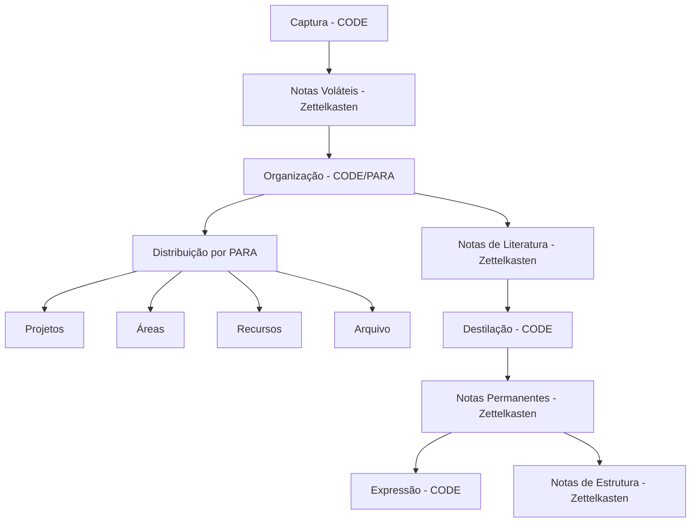

# Meu Sistema de Gestão de Conhecimento Pessoal

Este é meu segundo cérebro, construído com a integração de três sistemas poderosos em um único fluxo de trabalho automatizado.

## Sistemas Integrados

1. **[[pkm.zettel]]**: Sistema Zettelkasten (baseado em notas atômicas interconectadas)
2. **[[pkm.para]]**: Método PARA do Tiago Forte (Projetos, Áreas, Recursos, Arquivos)
3. **[[pkm.code]]**: Método CODE do Tiago Forte (Capturar, Organizar, Destilar, Expressar)

## Fluxo de Trabalho

Meu sistema integra os três métodos em um único fluxo de trabalho:

## Uso Diário

1. Começar com **[[pkm.daily.journal]]** para notas diárias (Capturar)
2. Organizar notas em **[[pkm.para]]** conforme necessário 
3. Processar notas importantes em notas permanentes em **[[pkm.zettel.permanent]]**
4. Criar conexões entre notas usando **[[pkm.zettel.structure]]**
5. Usar e compartilhar o conhecimento (Expressar)

---

## Recursos do Sistema

### 🚀 Início Rápido
- **[[pkm.quick-start]]** - Guia para começar imediatamente
- **[[pkm.automation]]** - Automações e configurações avançadas
- **[[templates.capture.quick]]** - Template de captura rápida

### 📋 Templates e Workflows
- **[[templates.review.weekly]]** - Revisão semanal estruturada
- **[[pkm.workflow]]** - Fluxo de trabalho completo
- **Todos os templates**: Use `Ctrl+L` → digite `templates.`

### ⚡ Comandos Essenciais
- **Ctrl+L**: Lookup (busca rápida)
- **Ctrl+Shift+D**: Criar/abrir nota diária
- **Ctrl+Shift+R**: Refatorar nota mantendo links
- **Ctrl+Shift+G**: Visualizar grafo de conexões

### 🔄 Fluxo de Captura
1. **Capturar**: `Ctrl+L` → digite `code.capture.ideia-rapida`
2. **Organizar**: Mova para hierarquia PARA usando refatoração
3. **Destilar**: Processe em notas permanentes
4. **Expressar**: Use em projetos e compartilhe

## Automatizações Implementadas

- ✅ Templates inteligentes para cada tipo de nota
- ✅ Schema automático para sugestões de estrutura
- ✅ Scripts de revisão e manutenção
- ✅ Fluxo de trabalho otimizado com timers
- ✅ Nomenclatura padronizada e navegação eficiente

## Documentação Completa

- **[[pkm.para]]** - Método PARA implementado
- **[[pkm.code]]** - Método CODE implementado  
- **[[pkm.zettel]]** - Zettelkasten implementado
- **[[pkm.resources.code]]** - Recursos CODE
- **[[pkm.resources.para]]** - Recursos PARA
- **[[pkm.resources.zettelkasten]]** - Recursos Zettelkasten
- **[[pkm.example.integration]]** - Exemplo prático de uso
