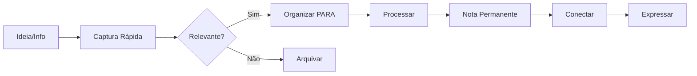

# 🚀 Guia de Início Rápido - Sistema PKM

Este guia irá ajudá-lo a começar a usar seu sistema PKM integrado (Zettelkasten + PARA + CODE) imediatamente.

## ⚡ Comandos Essenciais (Copie e Cole)

### 1. Captura Rápida de Ideia
```
Ctrl+L → digite: code.capture.{{YYYY.MM.DD}}.ideia-rapida
```

### 2. Nova Nota de Leitura
```
Ctrl+L → digite: zettel.literature.{{autor}}.{{titulo}}
```

### 3. Novo Projeto PARA
```
Ctrl+L → digite: para.projects.{{nome-projeto}}
```

### 4. Nota Diária
```
Ctrl+Shift+D (ou Ctrl+L → daily)
```

## 📋 Workflow de 5 Minutos (Diário)

1. **Abrir nota diária** (`Ctrl+Shift+D`)
2. **Anotar 3 prioridades** do dia
3. **Revisar capturas** do dia anterior
4. **Processar 1-2 notas** rápidas
5. **Planejar próxima captura**

## 🎯 Workflow de 30 Minutos (Semanal)

1. **Criar nota de revisão**: `Ctrl+L` → `review.weekly.{{YYYY.MM.DD}}`
2. **Usar template**: Copiar de [[templates.review.weekly]]
3. **Revisar todas as capturas** não processadas
4. **Mover notas** para PARA apropriado
5. **Atualizar projetos** ativos
6. **Criar/atualizar** 1 nota permanente
7. **Planejar** próxima semana

## 🔄 Fluxo de Informação



## 📁 Estrutura de Pastas Mentais

### PARA (Organização)
- **Projects** = Tem deadline, resultado específico
- **Areas** = Padrão de qualidade contínuo
- **Resources** = Tópicos de interesse futuro
- **Archives** = Itens inativos dos anteriores

### CODE (Processo)
- **Capture** = Coletar sem julgar
- **Organize** = Dar estrutura e contexto
- **Distill** = Extrair essência
- **Express** = Compartilhar e usar

### Zettelkasten (Conexão)
- **Fleeting** = Pensamentos rápidos
- **Literature** = Baseado em fontes
- **Permanent** = Conhecimento refinado
- **Structure** = Mapas de conceitos

## 🎨 Templates Disponíveis

| Tipo | Template | Uso |
|------|----------|-----|
| Captura | [[templates.capture.quick]] | Ideias rápidas |
| Leitura | [[templates.zettel.literature]] | Processamento de textos |
| Permanente | [[templates.zettel.permanent]] | Conhecimento destilado |
| Projeto | [[templates.para.project]] | Gestão de projetos |
| Revisão | [[templates.review.weekly]] | Revisões semanais |

## 🔗 Convenções de Links

### Nomenclatura
- **PARA**: `para.{categoria}.{nome}`
- **CODE**: `code.{fase}.{tópico}`
- **Zettel**: `zettel.{tipo}.{identificador}`

### Links Inteligentes
- Use `[[]]` para criar links automáticos
- Use `[[nota|texto]]` para texto personalizado
- Use tags `#` para categorização
- Use `^` para referenciar blocos específicos

## ⚙️ Configurações Recomendadas

### No Dendron
1. Ativar preview automático
2. Configurar hotkeys personalizados
3. Ativar graph view
4. Configurar workspace sync

### Atalhos Sugeridos
- `Ctrl+Shift+F`: Nova fleeting note
- `Ctrl+Shift+L`: Nova literature note
- `Ctrl+Shift+P`: Novo projeto PARA
- `Ctrl+Shift+G`: Abrir graph view

## 🎖️ Boas Práticas

### Capture
- ✅ Capture tudo, refine depois
- ✅ Use templates para consistência
- ✅ Adicione contexto mínimo
- ❌ Não se preocupe com perfeição

### Organize
- ✅ Processe regularmente (diário)
- ✅ Use hierarquia PARA
- ✅ Conecte notas relacionadas
- ❌ Não deixe acumular

### Distill
- ✅ Extraia insights únicos
- ✅ Use suas próprias palavras
- ✅ Cite fontes originais
- ❌ Não copie apenas

### Express
- ✅ Compartilhe conhecimento
- ✅ Use em projetos reais
- ✅ Ensine outros
- ❌ Não guarde só para você

## 🔧 Troubleshooting Rápido

### Problema: Muitas notas não processadas
**Solução**: Dedique 15 min diários para limpeza

### Problema: Não sei onde categorizar
**Solução**: Comece em `code.capture`, organize depois

### Problema: Não consigo conectar ideias
**Solução**: Use `zettel.structure` para mapear conceitos

### Problema: Sistema muito complexo
**Solução**: Comece só com captura diária, adicione complexidade gradualmente

---

## 📚 Próximos Passos

1. **Hoje**: Criar primeira nota diária
2. **Esta semana**: Capturar 5 ideias diferentes
3. **Próxima semana**: Fazer primeira revisão semanal
4. **Este mês**: Criar primeira nota permanente conectada

## 🔄 Links de Navegação

- [[pkm]] - Visão geral do sistema
- [[pkm.workflow]] - Fluxo de trabalho detalhado
- [[pkm.automation]] - Automações avançadas
- [[templates.daily]] - Template de notas diárias
