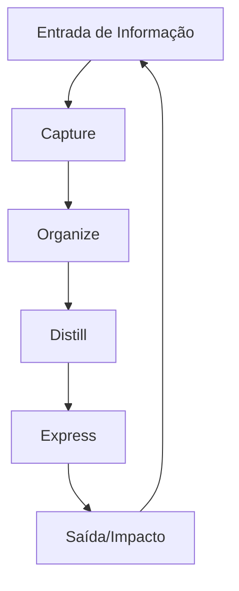

# Método CODE - Guia Completo

O método CODE foi desenvolvido por Tiago Forte como parte de sua metodologia "Building a Second Brain" e oferece um fluxo de trabalho sistemático para transformar informação em conhecimento acionável.

## O que significa CODE?

CODE é um acrônimo que representa as quatro etapas do processo:

### C - Capture (Capturar)

A primeira etapa é capturar informações valiosas que encontramos diariamente.

**Princípios-chave:**
- Capturar apenas o que ressoa (o que lhe parece interessante, útil ou inspirador)
- Salvar mais do que você acha que precisa, mas menos do que é possível
- Manter o processo de captura o mais simples possível
- Usar ferramentas que funcionam em diferentes dispositivos e contextos

**Práticas recomendadas:**
- Use critérios claro para o que vale a pena salvar
- Capture o conteúdo completo sempre que possível (não apenas links)
- Preserve o contexto da informação (fonte, data, autor)
- Não se preocupe com a organização nesta etapa

### O - Organize (Organizar)

A segunda etapa é organizar as informações capturadas em um sistema confiável.

**Princípios-chave:**
- Organizar para ação, não para perfeição
- Organizar com base na ação que você pretende tomar, não nas características da informação
- Usar o sistema PARA para organizar por projetos e áreas de responsabilidade
- Menos categorias é melhor que mais

**Práticas recomendadas:**
- Triage e organize informações regularmente (mas não constantemente)
- Use técnicas como a regra PARA (Projetos, Áreas, Recursos, Arquivos)
- Adicione metadados para melhor recuperação posterior
- Não crie categorias complexas ou hierarquias profundas

### D - Distill (Destilar)

A terceira etapa é destilação - identificar e extrair as partes mais valiosas do conteúdo.

**Princípios-chave:**
- Resumir e simplificar para seu futuro eu
- Destacar as partes mais importantes
- Identificar os princípios e padrões subjacentes
- Preparar o conteúdo para uso futuro

**Práticas recomendadas:**
- Destaque passagens importantes ao revisar material
- Crie sumários progressivos (resumos de resumos)
- Identifique os "blocos de construção" reutilizáveis
- Traduza o conteúdo para suas próprias palavras

### E - Express (Expressar)

A etapa final é transformar o conhecimento em expressões tangíveis e compartilháveis.

**Princípios-chave:**
- O conhecimento só tem valor quando aplicado
- Compartilhe seu trabalho para obter feedback
- Use seu conhecimento para resolver problemas reais
- Feche o ciclo transformando consumo em criação

**Práticas recomendadas:**
- Comece com pequenas expressões (notas, tweets, conversas)
- Reutilize blocos de conhecimento em diferentes projetos
- Mantenha um ciclo constante de consumo e produção
- Use feedback para refinar seu processo de captura

## Implementação do CODE no Dendron

### 1. Configuração de Hierarquias

```
pkm.code.capture
pkm.code.organize
pkm.code.distill
pkm.code.express
```

### 2. Integração com PARA

CODE oferece o "como" do processo, enquanto PARA fornece o "onde":
- **Capture** → Notas rápidas, sem preocupação com organização
- **Organize** → Distribua nas categorias do PARA
- **Distill** → Processe em notas permanentes (Zettelkasten)
- **Express** → Crie a partir das notas em projetos ativos

### 3. Fluxo de Trabalho



## Benefícios do Método CODE

1. **Reduz a Sobrecarga Cognitiva**: Divide o processamento de informações em etapas gerenciáveis
2. **Aumenta a Taxa de Reutilização**: Prepara informações para uso futuro
3. **Melhora a Qualidade da Criação**: Fornece blocos de construção pré-processados
4. **Fecha o Ciclo de Consumo-Criação**: Transforma consumo em expressão
5. **Escalável e Adaptável**: Funciona para qualquer volume de informação

## Recursos Adicionais

- [Building a Second Brain (Livro de Tiago Forte)](https://www.buildingasecondbrain.com/)
- [Forte Labs Blog](https://fortelabs.com/blog/)
