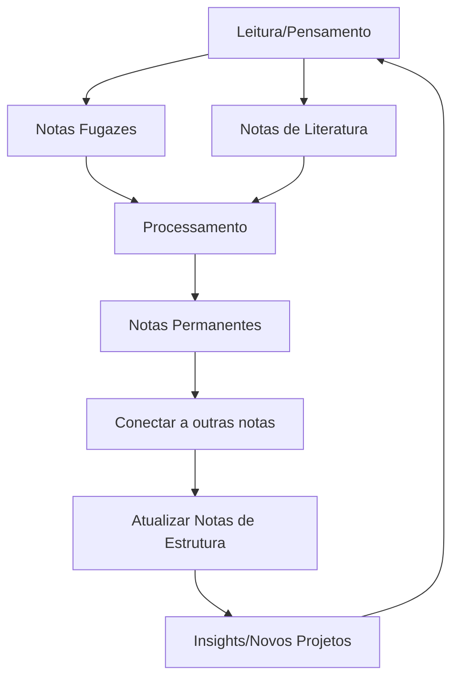

# Método Zettelkasten - Rede de Pensamentos

O Zettelkasten é um sistema de gestão de conhecimento desenvolvido por Niklas Luhmann que se baseia em notas atômicas interconectadas.

## Princípios do Zettelkasten

- **Atomicidade**: Cada nota contém apenas uma ideia
- **Conexão**: Notas são vinculadas a outras notas relacionadas
- **Emergência**: Novos insights surgem das conexões entre notas
- **Contextualização**: Cada conexão deve explicar o porquê da relação
- **Não-linearidade**: O conhecimento é uma rede, não uma hierarquia

## Tipos de Notas no Sistema

### [[pkm.zettel.fleeting]] - Notas Fugazes

Pensamentos rápidos e ideias temporárias.

**Características:**
- Capturadas no momento da inspiração
- Não precisam ser bem estruturadas
- Necessitam processamento posterior
- Entrada para o sistema

### [[pkm.zettel.literature]] - Notas de Literatura

Notas baseadas em material de leitura ou conteúdo externo.

**Características:**
- Resumos e insights de material lido
- Citações importantes com referências
- Escritas em suas próprias palavras
- Conexão com a fonte original

### [[pkm.zettel.permanent]] - Notas Permanentes

O coração do sistema Zettelkasten - ideias refinadas e atomizadas.

**Características:**
- Uma ideia por nota
- Completas por si só (autocontidas)
- Escritas como se comunicando com seu eu futuro
- Conectadas a outras notas permanentes
- Identificador único permanente (timestamp)

### [[pkm.zettel.structure]] - Notas de Estrutura

Mapas de navegação para tópicos específicos.

**Características:**
- Funcionam como índices ou sumários
- Agrupam notas relacionadas
- Mostram relacionamentos entre conceitos
- Criam contexto para navegação

## Implementação no Dendron

O Dendron é perfeito para o Zettelkasten por oferecer:

1. **Identificadores únicos**: Automáticos nas propriedades frontmatter
2. **Hierarquias flexíveis**: Usando a notação de pontos
3. **Refatoração sem quebrar links**: Mantém a integridade do sistema
4. **Busca poderosa**: Para encontrar e relacionar notas
5. **Visualização de gráfico**: Para ver conexões entre notas

## Fluxo de Trabalho Zettelkasten

## Integração com PARA e CODE

- **Capturar** → Notas Fugazes e de Literatura
- **Organizar** → Estruturar por PARA e refinar em Notas Permanentes
- **Destilar** → Criar conexões e Notas de Estrutura
- **Expressar** → Usar a rede para criar conteúdo
